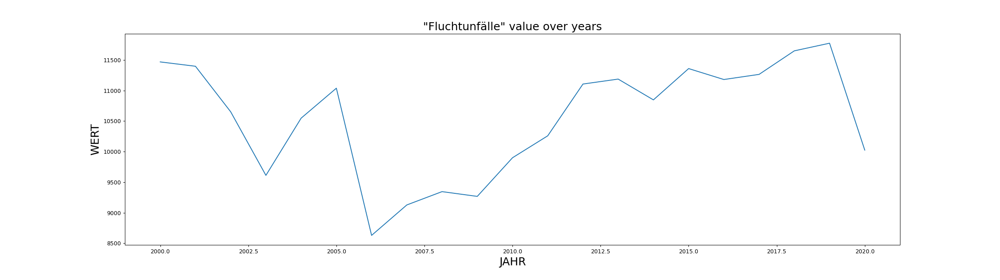
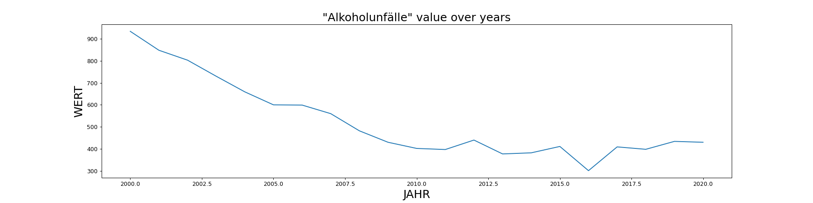
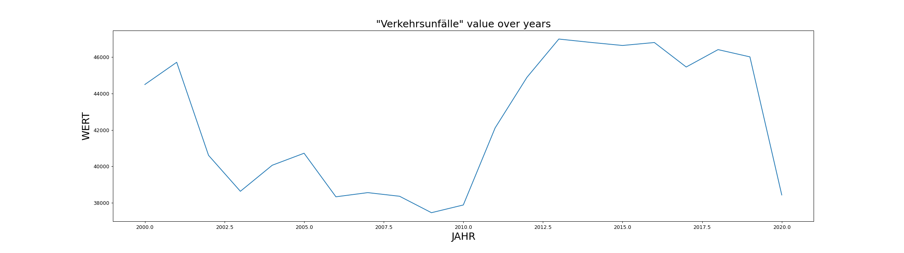
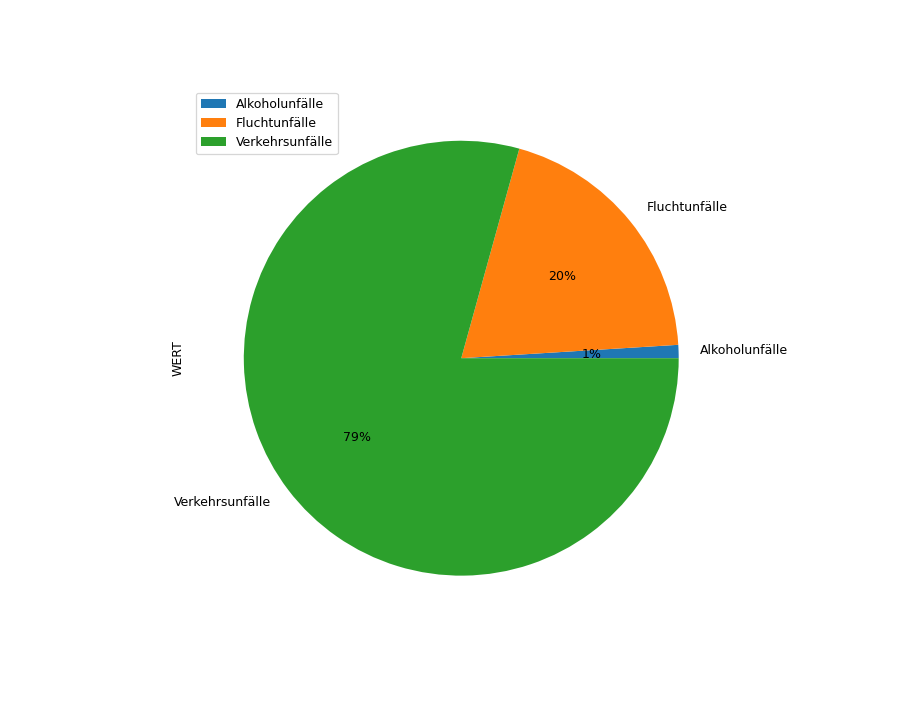

### This is repository deals with a generating an AI model to predict number of car accident based on available dataset presented by München Open Data Portal for years between 2000 till 2021. (https://opendata.muenchen.de/dataset/monatszahlen-verkehrsunfaelle/resource/40094bd6-f82d-4979-949b-26c8dc00b9a7)

##### Exploratory Data Analysis

###### Number of accidents caused by escape over years

###### Number of accidents caused by alcohol consumption over years

###### Number of accidents 'Verkehrsunfälle' over years

###### A pie chart for comparison the percentage of each category

